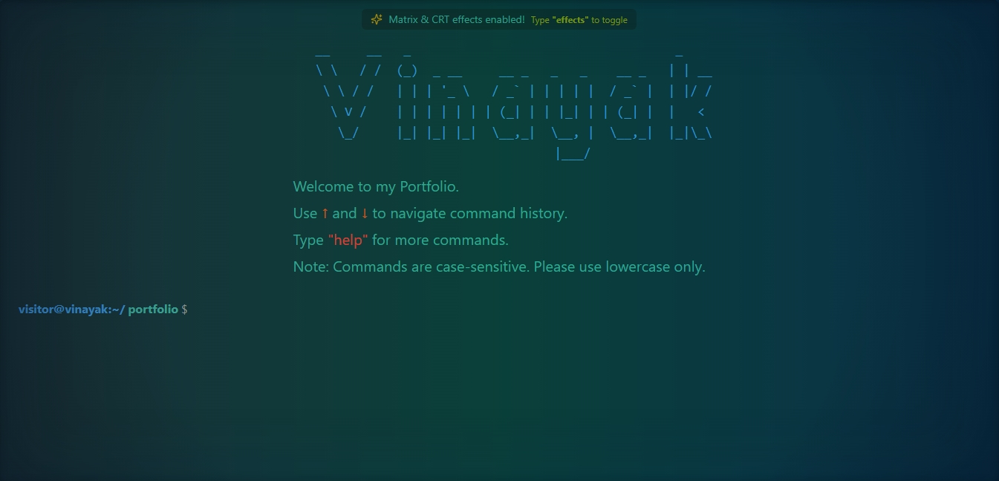
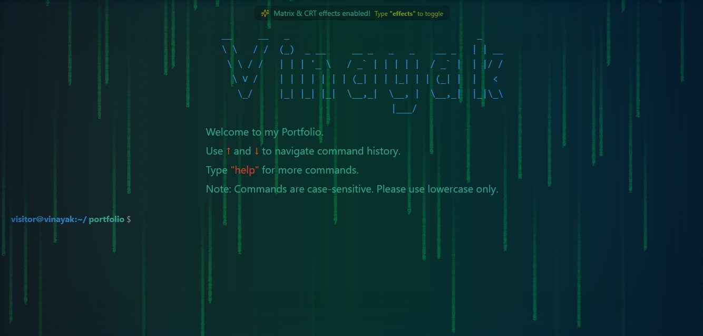
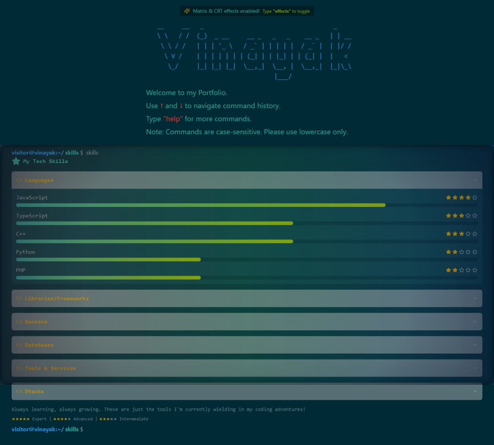
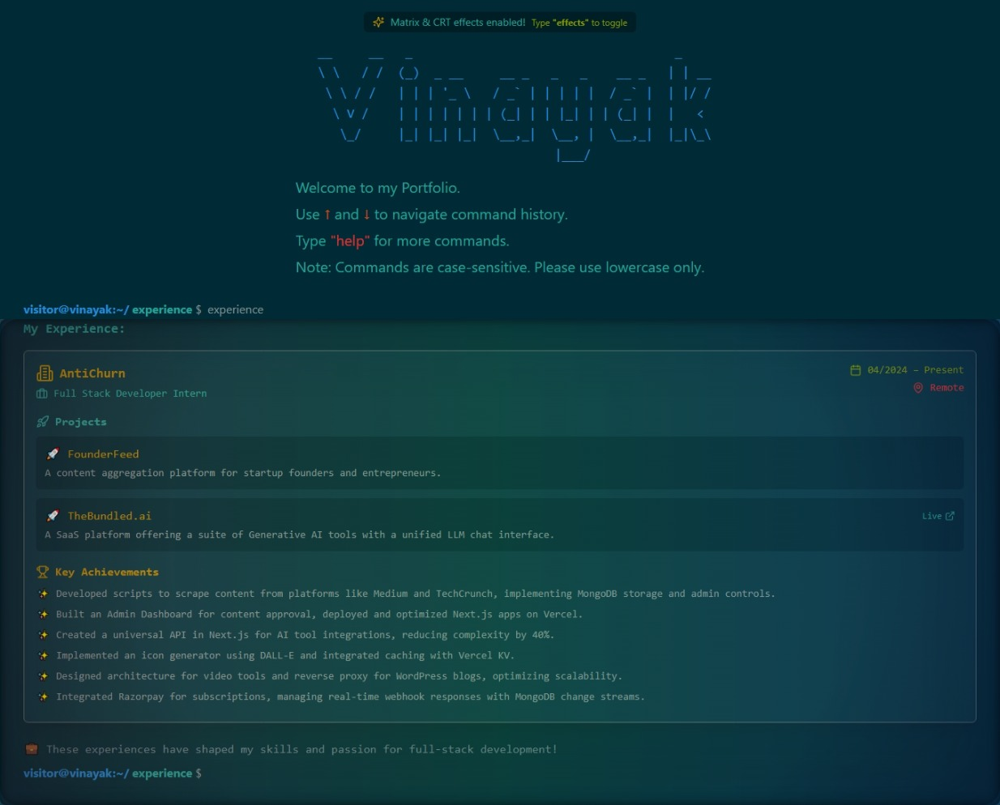
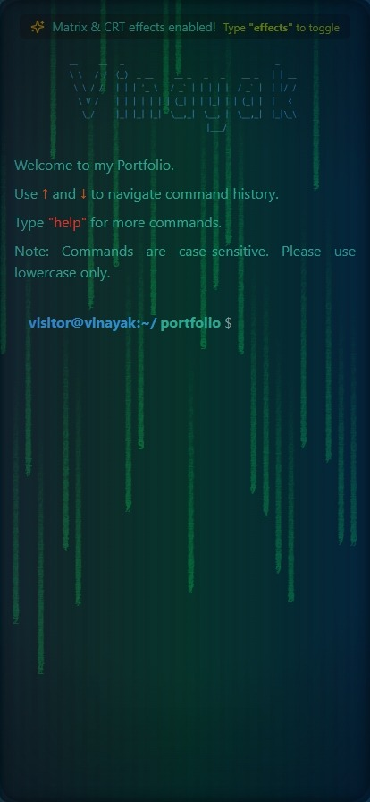

# <div align="center">⌨️ Terminal Portfolio | Vinayak Vispute</div>

<div align="center">
  
  
  
  
</div>

<div align="center">
  <h3>An interactive CLI-inspired developer portfolio with retro terminal vibes.</h3>

[View Live Demo](https://visputevinayak.co) • [Report Bug](https://github.com/VinayakVispute/terminal-portfolio/issues) • [Request Feature](https://github.com/VinayakVispute/terminal-portfolio/issues)

</div>

<div align="center">
  
  
  <!-- Replace with your actual screenshot path -->
  
</div>

---

## 📋 Table of Contents

- [✨ Features](#-features)
- [🚀 Getting Started](#-getting-started)
  - [Prerequisites](#prerequisites)
  - [Installation](#installation)
  - [Running Locally](#running-locally)
- [💻 Usage](#-usage)
  - [Available Commands](#available-commands)
  - [Keyboard Shortcuts](#keyboard-shortcuts)
  - [Special Effects](#special-effects)
- [🏗️ Project Structure](#️-project-structure)
- [🎮 Interactive Features](#-interactive-features)
- [🎨 Customization](#-customization)
- [🔧 Technical Implementation](#-technical-implementation)
- [📲 Responsive Design](#-responsive-design)
- [🤝 Contributing](#-contributing)
- [📄 License](#-license)
- [📞 Contact](#-contact)
- [🙏 Acknowledgments](#-acknowledgments)

---

## ✨ Features

- 🖥️ **Terminal Interface** - Authentic CLI experience with command history and autocomplete
- 🌟 **Visual Effects** - Toggle between Matrix rain and retro CRT effects
- 📊 **Skill Visualization** - Interactive progress bars and star ratings for skills
- ⏳ **Experience Timeline** - Visual timeline for work history with expandable details
- 📄 **Instant Resume Access** - View and download resume with a single command
- 🔄 **Command History** - Navigate through previous commands with arrow keys
- 🏆 **Project Showcase** - Elegant cards displaying projects with links to GitHub and live demos
- 🔗 **Social Integration** - Easy access to social profiles with interactive elements
- 📱 **Mobile Responsive** - Optimized experience across all devices
- 🎮 **Interactive UI** - Engaging animations and transitions throughout
- 🔍 **Command Filtering** - Search and filter command history with pattern matching

---

## 🚀 Getting Started

### Prerequisites

- Node.js (v18+ recommended)
- npm or yarn
- Git

### Installation

1. **Clone the repository**:

   ```bash
   git clone https://github.com/VinayakVispute/terminal-portfolio.git
   cd terminal-portfolio
   ```

2. **Install dependencies**:

   ```bash
   npm install
   # or
   yarn install
   ```

3. **Set up environment variables** (if needed):
   ```bash
   cp .env.example .env.local
   # Now edit .env.local with your values
   ```

### Running Locally

Start the development server:

```bash
npm run dev
# or
yarn dev
```

Visit `http://localhost:3000` in your browser to see the portfolio in action.

---

## 💻 Usage

### Available Commands

| Command      | Description                        | Features                                     |
| ------------ | ---------------------------------- | -------------------------------------------- |
| `help`       | List all available commands        | Command overview with descriptions           |
| `about`      | Personal introduction              | Bio and background information               |
| `skills`     | View technical skills              | Progress bars, star ratings, categories      |
| `projects`   | Browse portfolio projects          | Project cards with links and descriptions    |
| `experience` | See work history                   | Interactive timeline with expandable details |
| `socials`    | Display social media links         | Categorized links with copy functionality    |
| `resume`     | View or download resume            | Auto-redirect with loading animation         |
| `goals`      | Show current goals and aspirations | Categorized personal and professional goals  |
| `effects`    | Toggle Matrix/CRT visual effects   | Switch between visual modes                  |
| `codetime`   | View coding activity               | Visualized coding statistics                 |
| `clear`      | Clear the terminal screen          | Reset display                                |
| `history`    | Show command history               | Filtered history with search capability      |
| `echo`       | Display a line of text             | Text output with formatting                  |

### Keyboard Shortcuts

- `↑` / `↓` - Navigate through command history
- `Tab` - Auto-complete commands
- `Ctrl + L` - Clear screen
- `Ctrl + C` - Cancel current command

### Special Effects

The portfolio includes two special visual effects that can be toggled with the `effects` command:

1. **Matrix Rain** - Falling digital rain inspired by The Matrix
2. **CRT Effect** - Retro CRT monitor simulation with scan lines and flicker

<div align="center">
  
  
  <!-- Replace with your actual effects preview image path -->
  
</div>

---

## 🏗️ Project Structure

```
terminal-portfolio/
├── app/                # Next.js pages
├── components/
│   ├── effects/        # Visual effects (Matrix, CRT)
│   └── shared/         # Terminal components
├── public/             # Static assets
├── styles/             # Global styles
├── types/              # TypeScript type definitions
└── ... config files
```

Key components:

- **Terminal Interface** - Core terminal implementation
- **Command Components** - Individual command implementations
- **Visual Effects** - Matrix rain and CRT effect implementations

---

## 🎮 Interactive Features

### Skills Visualization

The `skills` command displays your technical abilities using:

- Visual progress bars showing proficiency level
- Star ratings for quick skill assessment
- Collapsible categories for organization

<div align="center">
  
  
  <!-- Replace with your actual skills preview image path -->
  
</div>

### Experience Timeline

The `experience` command shows your work history as an interactive timeline:

- Chronological organization with visual connectors
- Color-coded indicators for active positions
- Expandable details for project contributions

<div align="center">
  
  
  <!-- Replace with your actual experience preview image path -->
  
</div>

### Social Connections

The `socials` command provides interactive access to your online presence:

- Categorized links (Professional, Social Media, Contact)
- Copy-to-clipboard functionality for email
- Quick contact form for visitor inquiries

---

## 🎨 Customization

### Personalization Options

You can customize the portfolio by editing:

1. **Personal Information** - Update your details in the command components
2. **Color Scheme** - Modify the color variables in the CSS
3. **Projects** - Add or update your projects in the ProjectsCommand component
4. **Skills** - Adjust your skills and proficiency levels in SkillCommand
5. **Experience** - Update your work history in ExperienceCommand

---

## 🔧 Technical Implementation

### Built With

- **Next.js** - React framework for server-rendered applications
- **TypeScript** - Type-safe JavaScript
- **Tailwind CSS** - Utility-first CSS framework
- **Lucide Icons** - Consistent icon set
- **React Hooks** - For state management and side effects

### Performance Optimizations

- Lazy-loaded components for faster initial load
- Optimized animations for smooth performance
- Responsive design for all device sizes

---

## 📲 Responsive Design

The portfolio is fully responsive across devices:

- **Desktop** - Full terminal experience with all effects
- **Tablet** - Adapted layout with maintained functionality
- **Mobile** - Compact design optimized for touch interaction

<div align="center">
  
  
  <!-- Replace with your actual responsive preview image path -->
  
</div>

---

## 🤝 Contributing

Contributions are welcome! Here's how you can help:

1. Fork the repository
2. Create your feature branch (`git checkout -b feature/amazing-feature`)
3. Commit your changes (`git commit -m 'Add some amazing feature'`)
4. Push to the branch (`git push origin feature/amazing-feature`)
5. Open a Pull Request

Please read the [CONTRIBUTING.md](CONTRIBUTING.md) for detailed guidelines.

---

## 📄 License

This project is licensed under the MIT License - see the [LICENSE](LICENSE) file for details.

---

## 📞 Contact

Feel free to reach out if you have any questions or just want to connect!

- **Website**: [visputevinayak.co](https://visputevinayak.co)
- **GitHub**: [VinayakVispute](https://github.com/VinayakVispute)
- **LinkedIn**: [Vinayak Vispute](https://www.linkedin.com/in/vispute-vinayak/)
- **Email**: vinayakvispute4@gmail.com

---

## 🙏 Acknowledgments

- Inspired by classic terminal interfaces
- Icons provided by [Lucide](https://lucide.dev/)
- Matrix effect inspired by [The Matrix](https://www.warnerbros.com/movies/matrix)

---

<div align="center">
  <p>Created with ❤️ by Vinayak Vispute.</p>
  <p>© 2024. All rights reserved.</p>
  
  
</div>
